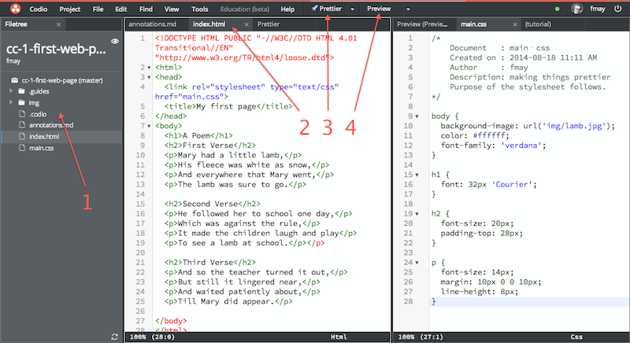
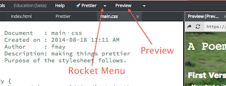

@annotation:tour intro
#Welcome to your Codio course
Welcome to your very first course in the Codio "Computing Curriculum" series of courses. 

We really hope you'll have fun learning about computing and especially how to code. You are encouraged to work with fellow students on this material. Writing code in the real world is actually a very collaborative process and so helping each other is normal and it is good.

You can navigate your way through this course using the buttons at the top.

Click the arrow button to move to the next page.

@annotation:tour IDE
#What's an IDE?
An IDE is the tool that developers use to manage their code. In fact, you're in an IDE right now! 

Before we start on looking at code, it is worth understanding the basics of the Codio IDE.



The sections below correspond to the numbers in the above screenshot and are important to know for this Course.

##1. The File Tree
Coding projects are made up of lots of files. The file tree is where these files live. It's very easy, really. You want to open a file, you click on it.

##2. Tabs
Once you open a file, it will open up in a tab. Tabs can be dragged to adjust their order or from one pane (you can see 2 big panes in the image) to another.

##3. Rocket Menu
This course has several projects. You are encouraged to play with the code in all of them, which means you are quite likely to mess them up. This menu allows you to restore each of these projects at will. You should click the arrow to drop down the list of items. Go ahead and play with it.

##4. Preview
You can press this button to preview your project. Previewing runs your code in a browser area within the Codio IDE. You can also have it previewed in a separate browser tab if you prefer.


@annotation:tour example1
#An extremely boring web page
Having said that coding is fun, we are going to start with an exceptionally dull example. 

We're now ready to look at our first code.

@annotation:tour indexhtml
#What is index.html?
We'll start off by opening up the file `index.html`, so go ahead and click on it in the file tree on the left.

> The `index.html` file is the file that most web sites open up automatically when accessed by a browser. On many web sites and applications, if you access something like 'www.yoursite.com' it will usually serve up index.html.

Now you've opened it up, you can see a familiar poem.

We'll explain how it works in a moment, but go to the next page and we'll first see how it looks in your browser or on your smartphone.

@annotation:tour preview
##Let's preview it now
So, let's now run this file in our preview window. At the top of the screen you will find the Preview button.



Press the button to preview. You'll now see a dull old web page appear in your browser.

@annotation:tour qrcode
#Got a smartphone handy?
If you happend to have a smartphone to hand, you can run this boring web page on that, too. Go to the 'Project->QR Code Preview URL' menu option and a QR code will appear on screen. If you've got a QR code reader, you can now scan this in to view the page.

If you've not got one, just download a free one from your app store.

@annotation:tour change
#Change something
So feel free to go ahead and change some of the text. You can add a fourth verse if you like.

##The Preview window


Here are some useful things to know about the Preview window.

- if you have made a change and want to reload the preview, press the refresh button
- you can break-out the contents of the preview window into a new browser tab (outside the Codio IDE)
- notice you are given the URL of your project. As long as your project is open, this can be used from any browser anywhere.


@annotation:tour cssintro
#Making it look prettier
We said how boring it was. We'll try to make it marginally less boring now by at least making it look a little prettier.

##Get some new code
Remember the Rocket menu item (explained twice before). Click on the arrow to drop down the list and select `Prettier` to load a new version of our project.

You'll notice you now have 2 files in the file tree

```
index.html
main.css
```
Open them both up by selecting them from the file tree.

@annotation:tour css openup
#Take a look at our new project
If you look at the `index.html` file, you'll see it has not changed one iota.

##Preview it
Now preview it again from the button in the top bar. You'll see that things have changed a lot.

In the next page, we'll explain how all these changes have happened despite the `index.html` not changing at all.

@annotation:tour explanation
#Explaining what has changed
Look at the top of `index.html` and you'll see that there is a new line added in the `<head>` section

```
<link rel="stylesheet" type="text/css" href="main.css">
```

This tells the browser that is needs to go and find the file called `main.css` (see it in the file tree?) and use it to style the page. 

`main.css` is what is known as a **stylesheet**. It contains instructions about how to visually style the various parts of the web page.

@annotation:tour elements
#Styling HTML elements
We can now take a quick look back at our `index.html` file and see how the relationship between the various HTML elements and the CSS file works.

The stuff inside `< >` are known as tags, and they surround an HTML element.

##The <body> element
Let's jump to the `<body>` tag. You'll see, at the very bottom of the file, the **closing tag**, which is `</body>`. Everything in between the opening and closing tags is a part of the `<body>` element.

Each web page's contents is always defined within the `<body>` element. 

##You must close Tags!!!
Well, every grammar has exceptions but just about every HTML tag needs a closing tag to match the opening tag.

```
<body> .... </body>
<h1> .... </h1>
<h2> .... <h2>
<p> ... </p>
```

Look at the `index.html` file and you'll see clearly what we mean.

##The <h1>, <h2> and <p> elements
Look at `index.html` again and find the various HTML elements in the page. 

- `<h1>` - this is a Header (level 1) element.
- `<h2>` - this is a Header (level 2) element and you'll find three of these on our page.
- `<p>` - this is a Paragraph element and you'll find lots of these. We've used one element for each line of our poem.

> In our page, these elements are **children** of the `<body>` element, because they are *nested* within the `<body> ... </body>` tags.

@annotation:tour elementscss
#Matching the HTML elements to our CSS file
Now take a look at `main.css`. Wherever we want to specify the appearance of an element, we simply add an entry into our CSS file in this format.

```
selector {
	property1: value;
	property2: value;
	.
	propertyN: value;
}
```

##Styling <h1> elements
So, to style the `<h1>` element of our page, we have created an `h1` *selector* in `main.css` with a `font` property :

```
h1 {
  font: 32px 'Courier';
}
```

This is saying, that wherever we encounter an `<h1>` HTML element, we want to display it using the 'Courier' font, with a 32 pixel font size.

> A *selector* is text pattern in a CSS file that matches an HTML element in an HTML file. If a match is made, then the CSS rule attached to that selector will be applied to the HTML element.

##Styling <p> elements
You will also see that we have styled the `<p>` elements like this :

```
p {
  font-size: 14px;
  margin: 10px 0 0 10px;
  line-height: 8px;
}
```

This is doing a little more, namely 

- changing the font-size to be 14 pixels
- we are applying a margin of 10 pixels space above, 0 pixels to the right, 0 pixels to the bottom and 10 pixels to the left of each and every `<p>` element
- we are setting the line height (gap between each line) to 8 pixels

@annotation:tour play
#Make some changes
Feel free to play around with a few values. If at any point you mess things up and don't know how to make it work again, you can do one of two things

1. Trying 'Undoing' changes in a file ('Edit->Undo' menu item). Notice the keyboard shortcut next to the menu item so you don't always have to use the menu.
2. From then Rocket menu, select the down arrow then select the 'Prettier' item, which will get all the files back the way they were from the start.

##Cause Damage
Don't worry about messing up your files. Be brave, experiment hard and learn from your mistakes.

You'd be surprised how much trial and error goes in the the world of coding.

@annotation:tour inherit
#Inheritance
This is a really cool feature and let's you engage your brain a bit more.

A CSS file gets its name from * **C**ascading **S**tyle **S**heet*. The reason for this is that the styles you create *cascade* down into *child* elements.

Take a look at this HTML

```
<body>
  <h1>A Poem</h1>
  <h2>First Verse</h2>
  ...
  ...
</body>
```

- `<body>` is a top level element
- `<h1>` is a child element of `<body>`
- `<h2>` is also a child element of `<body>`

Now look at the CSS. 

```
body {
  background-image: url('img/lamb.jpg'); 
  color: #ffffff;
  font: 8px 'verdana';
}
```

`body` is the first *selector* we have defined in our CSS file and it has the following properties

- `background-image` : we point it to a file located in the img folder in our file tree on the left. You can open it up and open the image file if you like. This will be displayed as the background image for the entire page.
- `color` : we are defining the default text color for the `<body>` element *and all of its children*
- `font-family` : the default font family for the for the `<body>` element *and all of its children* is #ffffff (white, you need six hexadecimal values here between 0 and 9 then a and f if you want to change it) 

Here comes the important bit

> any property settings we make for a *parent* (`<body>` in our case) element will automatically *cascade* to all its children (<h1>, <h2> and <p>).

##Overriding h1 and h2
In our `main.css` file we can see, for example, that the settings we make in the `body` selector are displayed for the `<p>` element but *NOT* for `<h1>` or for `<h2>`. The reason for this is that we subsequently override <h1> and <h2> with this CSS 

```
h1 {
  font: 32px 'Courier';
}

h2 {
  font-size: 20px;
  padding-top: 28px;
}
```

- `h1` gets a new font and a font-size assigned to it `font: 32px 'Courier'
- `h2` will keep the font ('verdana') specified in the `body` selector but the font size gets changed with `font-size: 20px`

Really think about this until you get it 100%. Playing around with the code is your best bet. Again, don't be afraid to mess up your code as you can restore it from the Rocket menu item.

@annotation:tour classes
#Using the 'class' attribute
We are going to take one last step in terms of complexity and understand two very important features of HTML and CSS - *classes* and *ids*.

From the Rocket menu, select 'Classes & IDs' and then preview it. We have managed to make it strikingly ugly again, but for a good reason.

##What's a <div> then?
In order to use classes efficiently in our example, we are nesting our verses inside <div> tags. A <div> defines simply a division or section in your HTML content. You will then typically add further content within your <div> as we have done. There's nothing magical about <div>s, so don't worry too much about them for now.

##What's changed?
Look at the `index.html` file and you will see that we have <p> tags for the introductory paragraph beneath the "Mary had a little lamb" header title. However, we also have used <p> tags for the verses. How do we style them differently even though they both use the <p> tags? 

##Classes
The answer is that we use a class *attribute* that looks like this

```
<div class="verse">
```

Another way of thinking about this is "this is a div and we'll give it a general classification of 'verse'".

Wherever we now specify this attribute, we can catch it for styling purposes in our CSS. You can see that we have specified `class="verse"` in each verse. 

Now look at `main.css`. You can see the following CSS 

```
.verse p {
  font-size: 14px;
  color: #99d8a0;
}
```

`verse p` tells the CSS to apply the styling just for the class named 'verse' and just for the <p> elements.

So, more formally

> A class is an HTML element attribute that is used such that a style can be applied to all occurrences of that class anywhere on a single HTML page.

@annotation:tour simpler
#Making the HTML simpler
We could have made this even simpler if we wanted and used just a single div around all three verses (in which case you could remove the <div>s surrounding each verse). We've left all 3 to show you how they can be used any number of times on a page. 

Why not change the code and see if you can do this?

@annotation:tour ids
#Using the 'id' attribute
The 'id' attribute is not nearly as useful as the 'class' attribute and much more restrictive. 

> A class can be used any number of times on a single HTML page. An 'id' can only be used one single time.

In fact, you could use a class instead of an id, athough not the other way round as the id can only be used once.

##Our example
In our example we have used an id to override the color of the title of the second verse.

In our HTML we have

```
<h2 id='red-head'>Second Verse</h2>
```
and in our CSS we catch this with 

```
#red-head {
    color: #db6b6b;
}
```
The `#red-head` selector indicates the application of an id.

@annotation:tour playclasses
#Try to ensure you've grasped 'class' and 'id'
Stare at the HTML and CSS files until you feel you really get what is going on. If staring doesn't help, then play around with the files and experiment, which should sort you out.

If you mess your files up, just select 'Classes & IDs' again from the Rocket menu item and it will restore your files.


@annotation:tour terms
#Recapping on some terminology
Terminology can seem tedious, but if you make sure you learn the correct terminology, you will find talking to others and looking things up on the Internet much easier.

So, make sure you are comfortable with the following terms, by referring back to the earlier contents

- HTML *Element*
- *Nested* elements
- HTML *Tag*
- CSS *Selector*
- CSS *Property*
- CSS *Property Value*
- *class* and *id*


@annotation:tour challenge
#Finding out stuff on your own
One of the skills that all professional developers have (and have to have) is the ability to research things on the web.

For example, no developer knows the full list of available HTML elements or CSS selectors and their properties and possible values.

##A little challenge
So, why don't you now have a go at playing with the Prettier project and try experimenting with some changes. Below is a list of some things you might want to try. 

- add a list of items and give them some basic styling (clue: research it as explained below)
- add your own image somwhere and don't worry about making it look too beautifully positioned. To add an image, you can drag one into the `img` folder or right click the folder and upload from the desktop. Or, you can refer to an image somewhere on the Internet.
- come up with your own challenge

##How to research
To help you with the above challenges, you can try any of the following research approaches

- Google "bullet points HTML"
- Google "bullet point styling CSS"
- An excellent HTML element reference is [Mozilla HTML Attribute reference](https://developer.mozilla.org/en-US/docs/Web/HTML/Element)
- And also for CSS [Mozilla CSS property reference](https://developer.mozilla.org/en/docs/Web/CSS/Reference)

So, see what you are able to accomplish with your `index.html` and `main.css` combination. 

Don't forget, you can reset your code at any time by selecting 'Prettier' from the list in the second right most menu item at the top.

@annotation:tour build
#Roll your own
Why not create your own web page now from scratch. We've set you up with your own basic template which you can activate by selecting 'Roll your own' from the Rocket icon menu at the top.

Do this on your own and show your friends. Just play around and have fun. 

@annotation:tour finally
#Finally ...
We'll finish this course off by showing you some other fun effects that can be achieved using just HTML and CSS.

Really don't worry about understanding everything that is going on, just have a look and enjoy, and see how much you can figure out just by observing.

The examples are all loaded by selecting the name from the Rocket dropdown menu (second one from the right at the top with the down arrow next to it).

Be sure to preview each one immediately after loading it.

##Transition
This demo shows you a really cool transition effect. Move your mouse over the image and notice the gradual transitioning in (and out when you move away) of color into the image. Then take a look at the HTML and CSS files.

##Sliding Tags
This shows how animated visual tags are created using just HTML and CSS. Move your mouse over them and click. Then take a look at the HTML and CSS files.

Notice how clean and simple the HTML is. The powerful stuff is done in the CSS. It's quite complex so don't worry if you don't understand it. You can always research what is going on by looking at the [Mozilla CSS property reference](https://developer.mozilla.org/en/docs/Web/CSS/Reference) or by Googling it.

##Menu
Here you'll find a nice menu constructed entirely out of HTML and CSS. Click on the buttons as well. We'd actually need a little bit of Javascript to make the buttons stay pressed. We'll get to that later. 

Again, see how clean and simple the HTML is. Generally speaking, keeping your HTML simple should be your goal. 

##Newspaper
This is a nice rendering of a newspaper layout. Notice the paper effect background. It doesn't resize horizontally, so you'll need to scroll to see the full width.


